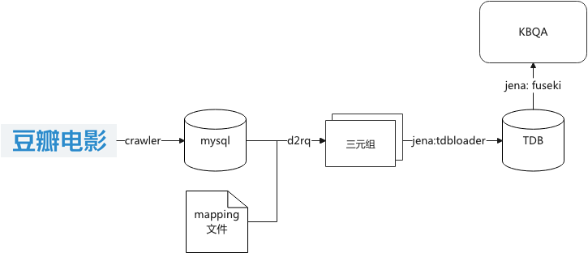

# KBQA-for-movie

这是参考知乎专栏[知识图谱-给AI装个大脑](https://www.zhihu.com/column/knowledgegraph)完成的基于规则的豆瓣电影知识图谱问答Demo，我也写了一个对应的踩坑文章[Apache jena fuseki实践踩坑笔记](https://zhuanlan.zhihu.com/p/460129220?)。

## 环境配置 

+ python 3.6+
+ 安装相关依赖：`pip install -r requirements.txt`
+ d2rq为0.8.1版本。转换时使用的mappling文件为`data/kg/kg_movie_mapping.ttl`，Protege定义的本体文件为`data/kg/kg_movie_owl.owl`，数据库dump出来的三元组数据存储在`data/kg/kg_movie_rdfs.nt`中。
+ jena为3.16.0版本，已经上传到jena目录下。电影图谱数据已经通过tdbloader转换为TDB格式数据，上传到`data/tdb`目录下。fuseki实现了无推理版本和规则推理版本，分别对应配置目录`jena/apache-jena-fuseki-3.16.0/run_tdb`和`jena/apache-jena-fuseki-3.16.0/run_tdb_inf`，可以通过启动脚本start.sh中`FUSEKI_BASE`环境变量设置使用哪一个配置文件。

## 运行方式

图谱数据已经上传到`data/kg/tdb`目录下， 因此只需启动fuseki服务器和问答服务。项目只提供了streamlit启动方式，运行`bash start.sh`即可。

## 数据说明

数据为爬虫爬取的豆瓣Top250电影。图谱设计了电影（`Movie`）、名人（`Celebrity`）、类型（`Genre`）和国家/地区（`Country`）四种实体。其中，名人实际包括了演员和导演两种实体，因此图谱中存在`(Movie, starring, Celebrity)`和`(Movie, directedBy, Celebrity)`两种关系。此外，还有`(Movie, isGenre, Genre)`和`(Movie, producedIn, Country)`两种关系。经过统计，该电影图谱中共有4237个实体（250部电影、3922位名人、27种类型和38个国家/地区），以及5794个关系（`starring: 4438, directedBy: 280, isGenre: 694, producedIn: 382 `）。

爬虫爬取的数据经过解析之后存储在数据库中，其包括movie, celebrity, genre, country, movie_to_actor, movie_to_director, movie_to_genre, movie_to_country几个表。这几个表的表结构请参见`crawler/db.py`文件中的注释。

## 技术架构和实现方法

数据从豆瓣电影到Jena Fuseki的完成流程如下图所示，爬虫从豆瓣电影爬取Top250电影信息，经过解析后存储到数据库中。再通过d2rq的dump-rdf工具和mapping文件转换为RDF三元组格式文件，再由Jena的tdbloader工具转换为fuseki使用的TDB格式。启动jena fuseki后即可向KBQA服务提供SPARQL查询功能。其实d2rq也提供SPARQL查询功能，但是它并没有转换数据库的数据为RDF，而是将SPARQL转换为sql语句直接在数据库中查询。因此，当数据量大或者访问频繁的时候开销很大，查询速度会比较慢。

图谱问答基于`REfO`工具，使用规则匹配方法完成问答。支持如下10种类型问题：

1. 某个演员出演了什么电影？
2. 某个电影有哪些演员参演？
3. 评分为X/以上/以上/之间的电影有哪些？
4. 某个人导演的评分为X/以上/以下/之间的电影
5. 演员A和演员B共同出演的电影？
6. 某个演员即出演又是导演的电影？
7. 某个国家上映的电影
8. 某个演员出演了哪些类型的电影
9. 某个演员出演的某个类型的电影有哪些
10. 某个演员出演了多少部电影

此外，有一些特殊的问题值得记录一下：

+ 豆瓣上对于发行国家/地区，区分了中国大陆、中国香港和中国台湾。当询问“中国发行的电影有哪些？” 或者“香港发行的电影有哪些？”时，需要分别对应上三个地区和中国香港。为了解决这个问题，在针对该类型问题时显式定义了对应关系，采用`FILTER IN`语句过滤匹配的国家/地区。

+ 外国演员的名字音译为中文后使用"·"作为分隔符，比如“娜塔莉·波特曼”。而我使用的是jieba分词，该工具会直接将"·"前后字符分开，分词结果为“娜塔莉/·/波特曼”。为了解决这个问题，我尝试了spacy。分词的结果虽然是正确的，但是由于规则匹配需要使用POS，而spacy在识别数字和电影名称时并不准确或者并不支持，从而无法匹配上规则。因此我的解决方法是在使用jieba分词后，将“·”前后的人名（即POS为nr的词）合并起来。

  

 

